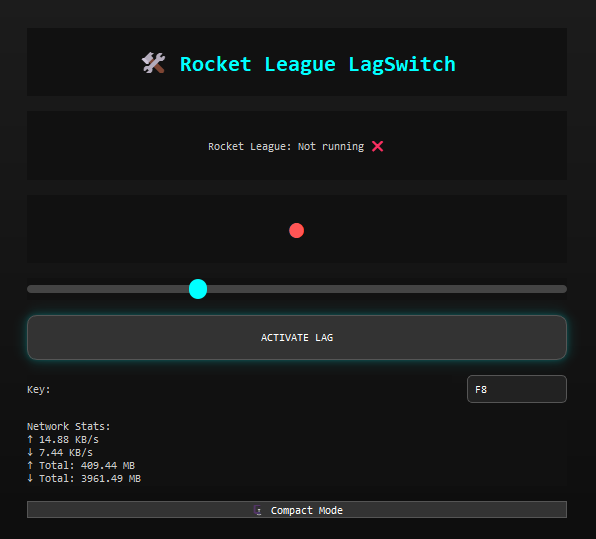
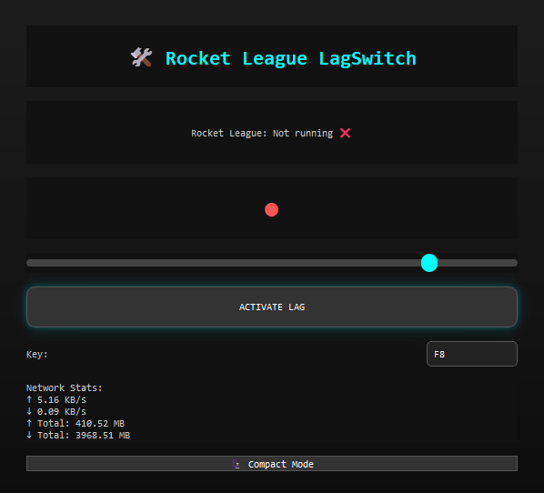
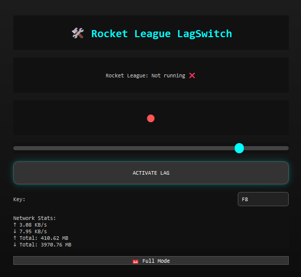

<!DOCTYPE html>
<html lang="en">
<head>
<meta charset="UTF-8" />
<meta name="viewport" content="width=device-width, initial-scale=1" />
<title>Rocket League LagSwitch - README</title>

</head>
<body>
  

    <h1>🚀 Rocket League LagSwitch - Python Edition</h1>
    

      A <strong>professional-grade, customizable LagSwitch tool</strong> designed specifically for Rocket League. 
      Built with Python and PyQt5, this tool simulates network lag to help <strong>Psyonix test anti-lag measures</strong> and ensure fair play for all.
    

    

    <h2>🔧 Features</h2>
    <ul>
      <li>🎮 <strong>Designed for Rocket League</strong></li>
      <li>💻 <strong>Real-time network traffic manipulation</strong></li>
      <li>🖥️ <strong>Modern animated GUI with neon-inspired design</strong></li>
      <li>🧠 <strong>Network usage stats (live upload/download)</strong></li>
      <li>🎛️ <strong>Custom lag duration slider (100ms – 3000ms)</strong></li>
      <li>⌨️ <strong>Configurable hotkey (default: F8)</strong></li>
      <li>🗜️ <strong>Compact Mode toggle</strong></li>
      <li>📊 <strong>Dark mode with smooth gradients and shadows</strong></li>
      <li>🧲 <strong>System tray minimization support</strong></li>
      <li>✅ <strong>Tested on Windows 10 &amp; 11</strong></li>
    </ul>

    <h2>📁 Project Structure</h2>
    <pre><code>RocketLeagueLagSwitch/
├── core/
│   └── traffic_controller.py       # Controls network delay logic
├── gui/
│   └── main_window.py              # Full GUI and interaction logic
├── utils/
│   ├── network_stats.py            # Real-time network monitoring
│   └── process_utils.py            # Rocket League process detection
├── main.py                         # Entry point of the application
└── README.md
</code></pre>

    <h2>📷 Screenshots</h2>
    <table>
      <tr>
        <th>Full Mode</th>
        <th>Compact Mode</th>
      </tr>
      <tr>
        <td></td>
        <td></td>
      </tr>
    </table>

    <h2>🚀 Getting Started</h2>
    <h3>🔗 Requirements</h3>
    <pre><code>pip install pyqt5 psutil keyboard</code></pre>

    <h3>▶️ Running</h3>
    <pre><code>python main.py</code></pre>

    
<strong>⚠️ Admin privileges may be required to simulate network lag properly.</strong>

    <h2>⚙️ Customization</h2>
    <ul>
      <li><strong>Hotkey</strong>: Enter a new key (e.g., <code>F9</code>, <code>Ctrl+Shift+L</code>) in the text input</li>
      <li><strong>Delay</strong>: Drag the slider to choose delay in milliseconds</li>
      <li><strong>Compact Mode</strong>: Click “🗜️ Compact Mode” to toggle a smaller layout</li>
      <li><strong>System Tray</strong>: Minimize the app and restore via tray icon</li>
    </ul>

    <h2>🧪 Use Case</h2>
    

      This LagSwitch was developed for <strong>internal testing purposes only</strong> to help game developers detect and prevent unfair network manipulation tactics in Rocket League. 
      <strong>Do not use this in online matches or for malicious purposes.</strong>
    

    <h2>🔐 Legal Disclaimer</h2>
    

      This software is intended strictly for <strong>educational and testing</strong> purposes. 
      We do <strong>not</strong> condone the use of lag-switching in competitive environments. 
      Use responsibly and only with <strong>explicit authorization</strong> from the relevant game or network owner.
    

    <h2>💡 Credits</h2>
    
Created by elpapitaslays with ❤️ 
      Special thanks to the <a href="https://www.psyonix.com" target="_blank" rel="noopener noreferrer">Psyonix</a> team for supporting ethical game development tools.
    

    <h2>📦 Packaging (optional)</h2>
    <pre><code>pip install pyinstaller
pyinstaller --noconfirm --windowed --icon=assets/icon.ico main.py
</code></pre>

    
Feel free to <a href="https://x.com/elpepasdev">contact me</a> for support or feedback!

  

</body>
</html>
